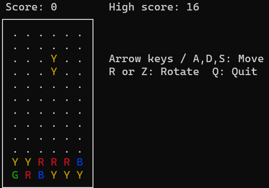

# PuyoPuyo

C++ と ncurses で制作した、同色のぷよを4個以上つなげて消す、ぷよぷよ風の落下パズルゲームです。
ゲームルール・画面表示・入力処理・ハイスコア保存を分離し、ゲームロジックを単体テストできる構成へリファクタリングしました。



## Features

- ランダムな2個組ぷよの生成
- 自然落下、左右移動、手動落下、回転
- 片方が接地した後、もう片方を落下させる重力処理
- 同色のぷよが4個以上つながった場合の消去
- 消去後の重力処理と連鎖
- スコアとハイスコアの表示・保存
- ゲームオーバー表示

## Controls

| Key | Action |
| --- | --- |
| `←` / `A` | Move left |
| `→` / `D` | Move right |
| `↓` / `S` | Move down |
| `R` / `Z` | Rotate clockwise |
| `Q` | Quit |

## Requirements

- C++17 compatible compiler
- CMake
- ncurses
- WSL / Ubuntu などの Linux 環境

Ubuntu / WSL では、必要に応じて次を実行します。

```bash
sudo apt update
sudo apt install -y build-essential cmake libncurses-dev
```

## Build and Run

プロジェクトのルートディレクトリで実行します。

```bash
cmake -S . -B build/ubuntu
cmake --build build/ubuntu --parallel
./build/ubuntu/puyopuyo
```

ハイスコアは実行時に `data/high_score.txt` へ保存されます。このファイルは個人のプレイ記録のため、Git 管理の対象外です。

## Test

ゲームルールとハイスコア保存を自動テストできます。

```bash
ctest --test-dir build/ubuntu --output-on-failure
```

現在、以下を含む4つのテスト実行ファイルを用意しています。

- `Board`：盤面の生成、範囲判定、コピー、初期化
- `Piece`：2個組ぷよの移動、回転、相方の座標計算
- `Game`：着地、消去、連鎖、重力、片方だけ接地した場合の落下
- `HighScoreStore`：ハイスコアファイルの読み書きと異常入力

## Project Structure

```text
src/
├─ main.cpp                 # ゲーム進行の制御
├─ domain/                  # ncurses に依存しないゲームルール
│  ├─ board.*               # 盤面
│  ├─ color.hpp             # ぷよの色
│  ├─ position.hpp          # 盤面上の座標
│  ├─ piece.*               # 2個組ぷよの移動・回転
│  └─ game.*                # 落下、固定、消去、重力、スコア
├─ storage/
│  └─ high_score_store.*    # ハイスコアのファイル保存
└─ ui/
   ├─ ncurses_session.*     # ncurses の開始・終了
   ├─ ncurses_input.*       # キー入力の変換
   └─ ncurses_renderer.*    # 盤面と情報の描画

tests/
├─ board_test.cpp
├─ piece_test.cpp
├─ game_test.cpp
└─ high_score_store_test.cpp

docs/
└─ refactoring-plan.md
```

## Design

- **ゲームルールを ncurses から分離**  
  `domain` 層は画面描画やキーボード入力に依存しません。そのため、盤面・ぷよ・消去・重力のルールを自動テストできます。

- **標準ライブラリによる安全なメモリ管理**  
  盤面のセル管理には `std::vector` を利用しています。手動のメモリ確保・解放を避け、ゲームルールの実装に集中できる設計にしました。

- **役割ごとの分離**  
  `ui` は ncurses による表示と入力、`storage` はファイル保存、`domain` はゲームルールだけを担当します。

- **段階的なリファクタリング**  
  動作する初版を `main` ブランチに保持し、リファクタリングは別ブランチで進めました。各段階でビルドと自動テストを実行し、動作を確認しています。

## Documentation

設計の整理とリファクタリングの進行は [docs/refactoring-plan.md](docs/refactoring-plan.md) に記録しています。
設計の詳細は [docs/architecture.md](docs/architecture.md) に記録しています。